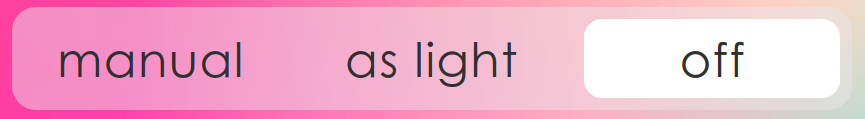

# Segmented Control

## Props
Attribute |        Type       | Description 
----------|-------------------|------------
Segments  | [{title: string}] | Array of descriptions for each segment. So far it contains only title.
onChange  | (number) => void  | Callback, which called if selected segment changes. The first argument of callback is an index of selected segment.
style     | Object            | Used for styling. Details described bellow in **Styling**

## Styling
Component has **style** prop, 
it is an object which describes style for different parts of component.
Object format described bellow.

Field/Element | Element Description
--------------|-----------
container     | Contains all other parts of component
item          | It's a segment itself. Holds segment text and reacts on click.
text     | Text of segment.
separator     | Separates items from each other. If you want to override margin, you should use marginTop/marginBottom), not simply margin.
thumb         | Selected element covers with thumb. Should have the same height as container. It's invisible but has a child **thumbVisible**.
thumbVisible  | As said before, it's a child of thumb. Visible part is smaller than thumb.
        

